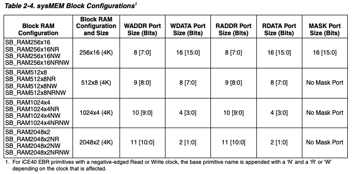

TinyFPGA BX LED Pi
==================

The TinyFPGA BX utilizes the ICE40LP8K chip by Lattice Semi. [Datasheet](http://www.latticesemi.com/~/media/LatticeSemi/Documents/DataSheets/iCE/iCE40LPHXFamilyDataSheet.pdf)

The ICE40 series contains embedded block RAM (EBR), which each are 4 kbit. The ICE40LP8K contains a total of 128 kbit of EBR, which is the most out of any chips in the ICE40 line.

That's pretty neat.
In my previous try with the TinyFPGA A2, I didn't realize it had EBR. If I had known that, I probably could have made that model work.
But I already switched to the BX, and it has some nicer things about it so I'm sticking with it! Namely:

* USB programming interface
* Command line interface - I don't need to download a huge IDE and run Windows
* Less file cruft, due to the tinyprog programmer
